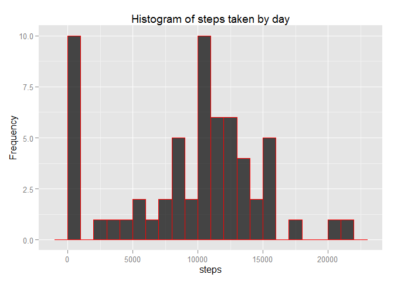
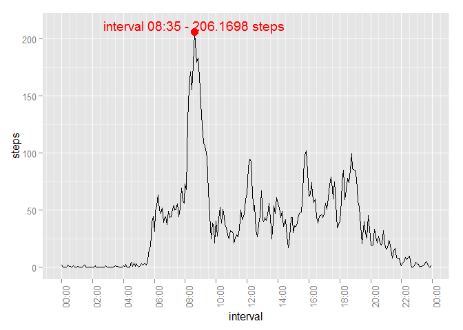
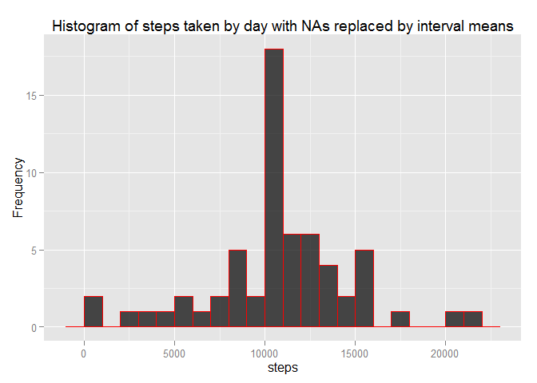
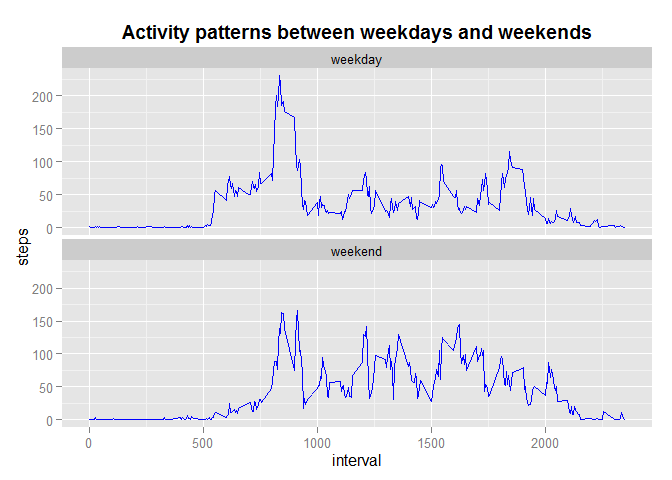

# Reproducible Research: Peer Assessment 1
Diego Gaona  
Saturday, May 16, 2015  
## Loading and preprocessing the data
Set knitr options

```r
library(knitr)
opts_chunk$set(echo = T, cache = F)
knitr::opts_chunk$set(tidy=FALSE, fig.path='figures/')
```
Load necessary packages

```r
require("ggplot2")
require("scales")
```
Set to english language and time, load the data and transform interval to 4 digits

```r
Sys.setlocale("LC_TIME", "English")
## Load data
rawactivity <- read.csv("activity.csv")
## Create a dataset to work and transform the all the interval variables in 4 digits
activity <- rawactivity
activity$interval <- sprintf("%04d", activity$interval)
```
## What is mean total number of steps taken per day?

*1. Plot total number of steps taken each day and calculate mean & median*  
Summarize the data, sum steps by day. I replaced the NAs for 0, i think the histogram is more complete this way.

```r
sumstepsbyday <- aggregate(steps ~ date, activity, sum, na.action = na.pass)
## Replace NA in steps, by 0 to be showed in the histogram
sumstepsbyday$steps[is.na(sumstepsbyday$steps)] <- 0
```
Make a histogram of the steps by day  

```r
p <- ggplot(sumstepsbyday, aes(steps)) ## Initializes ggplot object
p <- p + geom_histogram(col="red", fill="black", alpha = .7, binwidth = 1000)
p <- p + ylab("Frequency") +  xlab("steps") ##  Show labels
p <- p + ggtitle("Histogram of steps taken by day") ## Show the title
p
```

 

*2. Calculate and report the mean and median total number of steps taken per day*

```r
## Return the mean steps by day
meanstepsbyday <- mean(sumstepsbyday$steps, na.rm = TRUE)
## Return the median steps by day
medianstepsbyday <- median(sumstepsbyday$steps, na.rm = TRUE)
## Summarize the average steps by interval
meanstepsbyinterval <- aggregate(steps ~ interval, activity, mean)
```
The mean of steps by day is **9354.23** and a median of **10395** steps per day.

## What is the average daily activity pattern?
*1. Make a time series plot (i.e. type = "l") of the 5-minute interval (x-axis) and the average number of steps taken, averaged across all days (y-axis) and 2. Which 5-minute interval, on average across all the days in the dataset, contains the maximum number of steps?*  

```r
## Transform interval in Posix
time1 <- meanstepsbyinterval$interval
time1 <- as.POSIXct(strptime(time1, "%H%M"))
meanstepsbyinterval$interval <- time1
## Find the max steps interval
max_stepsinterval <- meanstepsbyinterval[which(meanstepsbyinterval$steps==max(meanstepsbyinterval$steps)),]
## Make the plot using ggplot2
p2 <- ggplot(meanstepsbyinterval, aes(interval, steps)) + geom_line() +
      scale_x_datetime(labels = date_format("%H:%M"),
                       breaks = date_breaks("2 hour"), minor_breaks=date_breaks("30 min")) + 
      xlab("interval") + ylab("steps") +
      theme(axis.text.x = element_text(angle = 90, hjust = 1)) +
      annotate("text", x = max_stepsinterval$interval, 
               y = max_stepsinterval$steps + 6, label = "interval 08:35 - 206.1698 steps", colour = "red") +
      annotate("pointrange", x = max_stepsinterval$interval, y = max_stepsinterval$steps, 
               ymin = 206, ymax = 206, colour = "red", size = 1)
p2
```

 

The 5 minute interval on average acreoss all the days containing the maximum number of steps is **08:35 with 260.17 steps**  
## Imputing missing values
Input the new values to replace the NAs.  
*1. Calculate and report the total number of missing values in the dataset (i.e. the total number of rows with NAs)*  

```r
## Find the sum of NA in the steps intervals
sum_na <- length(which(is.na(rawactivity$steps)))
```

The sum of NAs is **2304**  

*2. Devise a strategy for filling in all of the missing values in the dataset. The strategy does not need to be sophisticated. For example, you could use the mean/median for that day, or the mean for that 5-minute interval, etc. and 3. Create a new dataset that is equal to the original dataset but with the missing data filled in.*  
I replaced the NAs with the means values of the 5-minutes intervals.


```r
## Make the means by interval without Posix
rawmeansbyinterval <- aggregate(steps ~ interval, rawactivity, mean)
## Merge the raw DF with the filled DF by interval
newactivity <- merge(rawactivity, rawmeansbyinterval, by = "interval", suffixes = c("", ".n"))
## Get the NA rows
NAs <- is.na(newactivity$steps)
## Replace the NA with the means in rawmeansbyinterval
newactivity$steps[NAs] <- newactivity$steps.n[NAs]
## Remove the column steps.n
newactivity <- newactivity[,c(1:3)]
## ## Summarize the new filled data, sum steps by day
newsumstepsbyday <- aggregate(steps ~ date, newactivity, sum)
```

*3. Make a histogram of the total number of steps taken each day and Calculate and report the mean and median total number of steps taken per day. Do these values differ from the estimates from the first part of the assignment? What is the impact of imputing missing data on the estimates of the total daily number of steps?*  
Bellow the new histogram with the filled data.


```r
## Plot with lines separated by type color
p3 <- ggplot(newsumstepsbyday, aes(steps)) ## Initializes ggplot object
p3 <- p3 + geom_histogram(col="red", fill="black", alpha = .7, binwidth = 1000)
p3 <- p3 + ylab("Frequency") +  xlab("steps") ##  Show labels
p3 <- p3 + ggtitle("Histogram of steps taken by day with NAs replaced by interval means") ## Show the title
p3
```

 

Calculate mean and median based on the filled data:

```r
## Return the mean steps by day with the filled data
newmeanstepsbyday <- mean(newsumstepsbyday$steps, na.rm = TRUE)
## Return the median steps by day with the filled data
newmedianstepsbyday <- median(newsumstepsbyday$steps, na.rm = TRUE)
```

The new mean steps by day based on the filled data is **10766.19** and the median is **10766.19**

Because i used the mean per interval to replace the NAs, my new mean and median are equal.
The major difference in the histogram is in the 0 values, what in the begin i used to replace the NAs.
The difference between the old and the new mean is **13.11%** and the difference between the old and the new median is **3.45%**, a major difference in the mean.  
The difference between the old and new sum of steps is **86130**

## Are there differences in activity patterns between weekdays and weekends?
*1. Create a new factor variable in the dataset with two levels -- "weekday" and "weekend" indicating whether a given date is a weekday or weekend day.*  
Now i imputed the weekdays in the filled dataset.  

```r
## Transform the date column in the filled data in Posix
newactivity$date <- strptime(newactivity$date, "%Y-%m-%d")
## Create a column with the weekdays
newactivity$weekdays <- weekdays(newactivity$date)
## Replace the days names by weekend or weekday
newactivity$weekdays[newactivity$weekdays %in% c("Sunday", "Saturday")] <-"weekend"
newactivity$weekdays[newactivity$weekdays %in% 
                           c("Monday", "Tuesday", "Wednesday", "Thursday", "Friday")] <-"weekday"
## Transform the weekdays column in factor
newactivity$weekdays <- factor(newactivity$weekdays, levels = c("weekday", "weekend"),
                               labels = c("weekday", "weekend"))
```

*2. Make a panel plot containing a time series plot (i.e. type = "l") of the 5-minute interval (x-axis) and the average number of steps taken, averaged across all weekday days or weekend days (y-axis).*
Now i create a time series plot with panels showing the difference between the steps in weekdays and weekends.  

```r
## Average by interval and weekday
newmeanstepbyint_week <- aggregate(steps ~ interval + weekdays, newactivity, mean)
## Create a plot with activity patterns between weekdays and weekends
p4 <- ggplot(newmeanstepbyint_week, aes(interval, steps)) + geom_line(colour = "blue") +     
      xlab("interval") + ylab("steps") +
      ggtitle(expression(bold("Activity patterns between weekdays and weekends"))) +
      facet_wrap(~ weekdays, ncol = 1)      
p4
```

 


